# EchoMind 架构图（Mermaid 版）

本文档用 Mermaid 描述 EchoMind 智能客服系统的架构，**重点体现状态流转与数据流转**。

代码依据：

| 层 | 文件 |
|----|------|
| 入口 / 路由 | `api/main.py` |
| 意图识别 | `core/intent_recognizer.py` |
| 多 Agent 编排 | `agents/agent_orchestrator.py` |
| 三级记忆 | `memory/conversation_memory.py` |
| MCP 工具框架 | `mcp/tool_manager.py` |
| RAG 知识库 | `mcp/knowledge_base.py` |
| Skills 热加载 | `core/skill_loader.py` |
| 监控 | `monitor/performance_monitor.py` |
| 评测 | `evaluation/evaluator.py` |
| 部署 | `docker-compose.yml`、`config/nginx/nginx.conf` |

---

## 1. 总体架构（分层 + 数据流向）

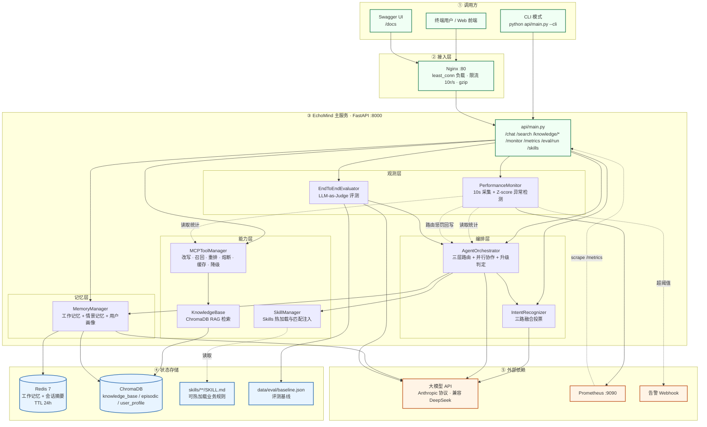

**数据流要点**

1. 请求统一从 Nginx 进入 FastAPI，Nginx 只做负载、限流和代理，不感知业务状态。
2. `api/main.py` 是唯一的状态编排入口：**先读记忆 → 再识别意图 → 再决定是否 RAG → 最后调 Orchestrator**。
3. 状态分三处落地：Redis（短期、带 TTL）、ChromaDB（长期、持久化）、文件系统（Skills 与评测基线）。
4. 监控是**闭环**：`Monitor → 计算 monitor_penalty → Orchestrator 路由权重`，不是单向观测。

---

## 2. `/chat` 主链路时序图（数据流转全路径）

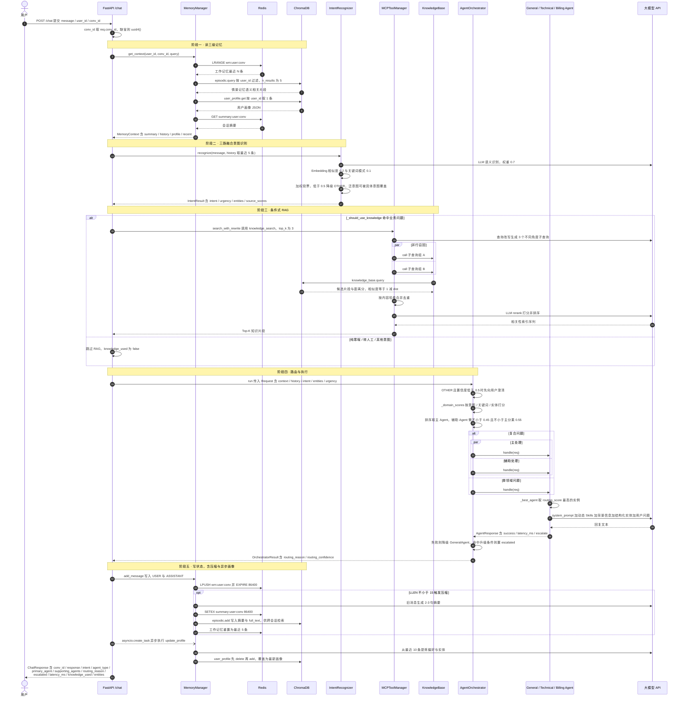

---

## 3. 三级记忆状态流转（核心状态机）

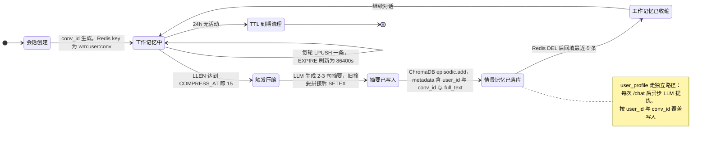

**状态存储对照表**

| 记忆层级 | 存储 | 键 / Collection | 生命周期 | 写入时机 |
|----------|------|-----------------|----------|----------|
| 工作记忆 | Redis List | `wm:{user_id}:{conv_id}` | 24h TTL | 每轮对话后 LPUSH |
| 会话摘要 | Redis String | `summary:{user_id}:{conv_id}` | 24h TTL | 消息数 ≥ 15 触发压缩 |
| 情景记忆 | ChromaDB | `episodic` | 持久化 | 压缩时写入摘要 |
| 用户画像 | ChromaDB | `user_profile` | 持久化 | 每轮异步覆盖 |
| RAG 知识库 | ChromaDB | `knowledge_base` | 持久化 | 文档导入 / 首次启动灌默认文档 |

---

## 4. 多 Agent 路由决策流

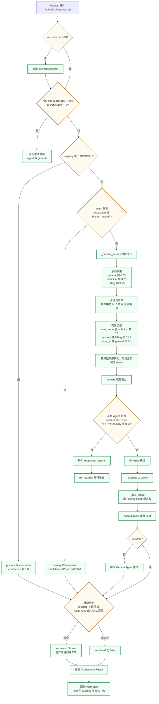

**routing_score 计算（性能路由的量化依据）**

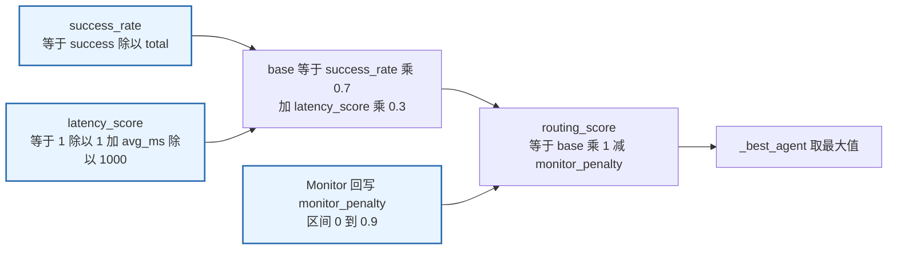

---

## 5. MCP 工具调用状态机 + 检索优化链路

### 5.1 熔断器三态机

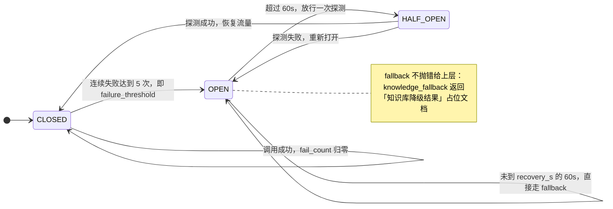

### 5.2 单次工具调用执行链

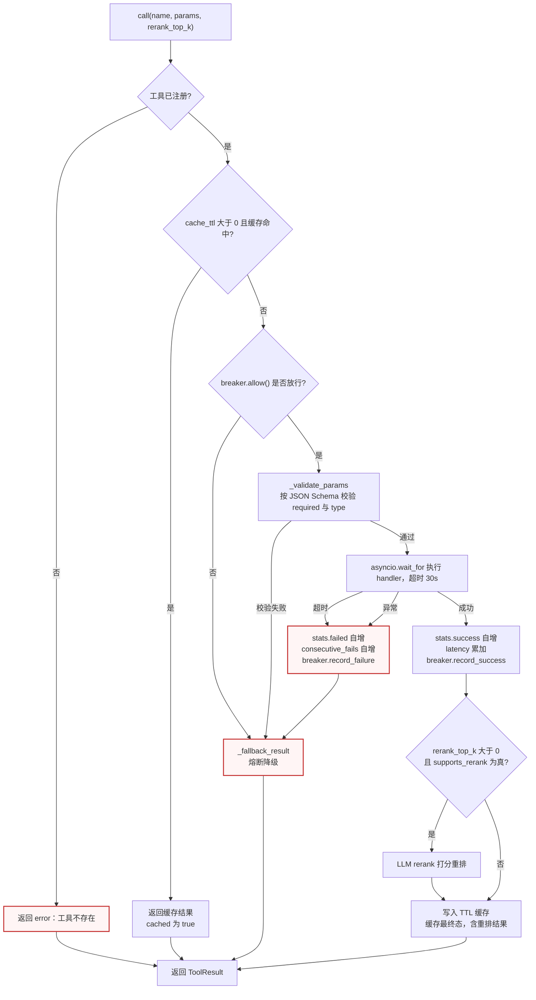

### 5.3 检索优化链路（解决召回不全与召回不好）

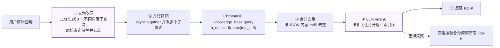

---

## 6. 监控到路由的反馈闭环（状态回流）

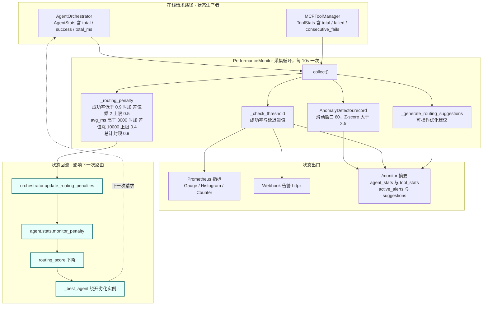

**阈值表**

| 指标 | 阈值 | 判定 | 严重级 |
|------|------|------|--------|
| `agent_success_rate` | < 0.90 | less_than | ERROR |
| `tool_success_rate` | < 0.95 | less_than | WARNING |
| `agent_avg_ms` | > 3000 | greater_than | WARNING |
| `tool_avg_ms` | > 5000 | greater_than | ERROR |

---

## 7. 评测闭环（质量状态的回写）

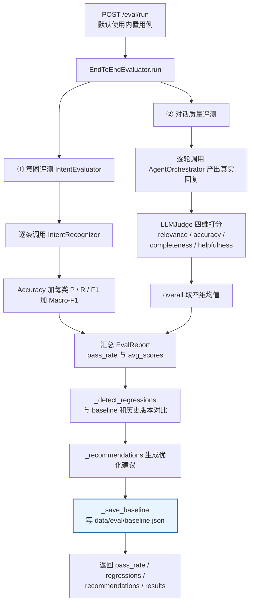

---

## 8. Skills 注入与热加载状态流

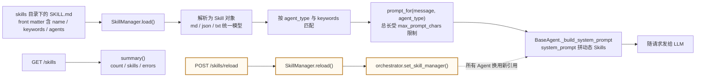

| Skill | 目标 Agent | 匹配关键词（节选） |
|-------|-----------|-------------------|
| 通用客服接待规范 | `general` | 你好、咨询、帮助、订单、投诉、转人工 |
| 技术支持处理规范 | `technical` | 报错、崩溃、无法登录、500、401、超时、日志 |
| 账单退款处理规范 | `billing` | 退款、扣款、支付、账单、发票、订阅 |

---

## 9. 部署拓扑（Docker Compose）

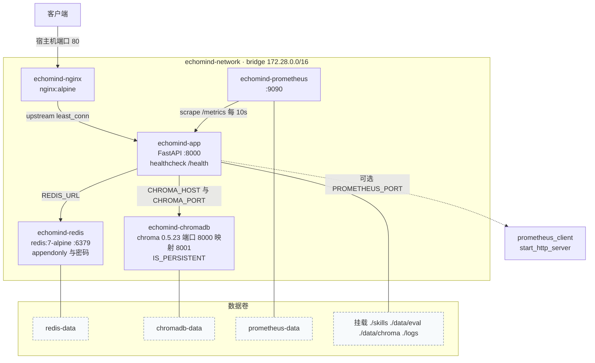

**启动顺序（depends_on 加 healthcheck 驱动）**

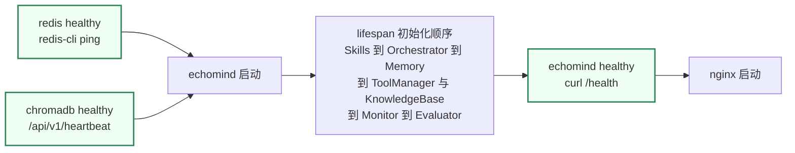

---

## 10. 接口与状态读写映射表

| 接口 | 方法 | 读取的状态 | 写入的状态 |
|------|------|-----------|-----------|
| `/chat` | POST | Redis 工作记忆 + 摘要、ChromaDB 情景记忆 + 画像、知识库 | Redis 工作记忆 / 摘要、ChromaDB 情景记忆 + 画像、AgentStats |
| `/search` | POST | ChromaDB `knowledge_base`、工具缓存 | 工具缓存、ToolStats |
| `/knowledge/add` | POST | — | ChromaDB `knowledge_base`（500 字切片） |
| `/knowledge/upload` | POST | — | ChromaDB `knowledge_base`（txt / md / json） |
| `/knowledge/stats` | GET | ChromaDB `knowledge_base` | — |
| `/monitor` | GET | AgentStats、ToolStats、告警、建议 | — |
| `/metrics` | GET | Prometheus 注册表 | — |
| `/skills` | GET | SkillManager 内存态 | — |
| `/skills/reload` | POST | `skills/` 目录 | SkillManager 内存态、Orchestrator 引用 |
| `/eval/run` | POST | Orchestrator、IntentRecognizer、baseline | `data/eval/baseline.json` |
| `/health` | GET | Orchestrator 就绪态 + AgentStats | — |

---

## 11. 关键状态常量速查

| 常量 | 值 | 位置 | 作用 |
|------|-----|------|------|
| `WORKING_MAX` | 20 | `MemoryManager` | 工作记忆单次读取上限 |
| `COMPRESS_AT` | 15 | `MemoryManager` | 触发 LLM 压缩的消息数阈值 |
| 压缩保留量 | 最近 5 条 | `_compress` | 压缩后工作记忆长度 |
| Redis TTL | 86400s | `add_message` / `_compress` | 工作记忆与摘要过期时间 |
| `HISTORY_TOP_K` | 5 | `MemoryManager` | 情景记忆检索条数 |
| `confidence_threshold` | 0.5 | `IntentRecognizer` | 低于该值降级为 OTHER |
| 融合权重 | 0.7 / 0.2 / 0.1 | `_vote` | LLM / Embedding / Pattern；无 Embedding 时 0.85 / 0.15 |
| `failure_threshold` | 5 | `CircuitBreaker` | 连续失败开启熔断 |
| `recovery_s` | 60.0 | `CircuitBreaker` | OPEN 转 HALF_OPEN 探测间隔 |
| `cache_ttl` | 300s | `knowledge_search` 注册参数 | 工具结果缓存时长 |
| `timeout_s` | 30.0 | `Tool.timeout_s` | 工具执行超时 |
| 缓存容量 | 5000 条 | `_set_cache` | 超出清掉最旧 1/4 |
| 辅助 Agent 门槛 | ≥ 0.45 且 ≥ 主分 × 0.55 | `_route_decision` | 是否纳入并行协作 |
| 切片大小 | 500 字 | `KnowledgeBase._chunk_text` | 文档导入切片 |
| 采集间隔 | 10s | `MONITOR_INTERVAL` | 监控采样周期 |
| Z-score 灵敏度 | 2.5（窗口 60） | `AnomalyDetector` | 异常判定 |
| 路由惩罚上限 | 0.9 | `_routing_penalty` | monitor_penalty 封顶 |
